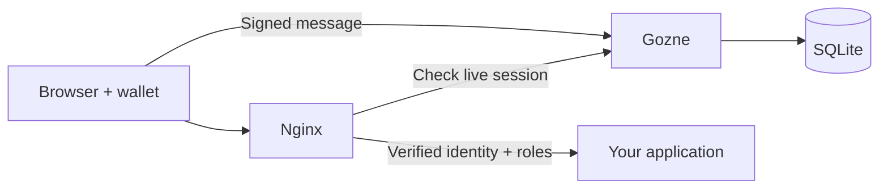

<div align="center">

# 🚪 Gozne

**Sign. Turn. Enter.**

Your wallet opens the door. Your server decides what happens next.

[](https://github.com/enriquegrx/gozne/actions/workflows/ci.yml)


</div>

Gozne is a **self-hosted wallet authentication gateway** with temporary access
and signed approvals. Put it in front of an HTTP application, define who can
enter, and keep control of sessions on your own server.

A wallet proves ownership by signing a message. Gozne checks it, creates an
opaque session and tells the reverse proxy whether to let the request through.
Your application receives a verified identity and roles. It needs no blockchain
libraries or access to anyone's keys.

> 🛠️ **Working alpha.** EVM and Solana authentication, wallet-bound invitations
> and a control panel are implemented. Signed deployment approvals run a
> **simulation**: they record an effect in SQLite and never deploy
> infrastructure. There is no stable release or external security audit yet.

## A door for your tools 🔑

Private documentation, an internal dashboard, a small team portal, a service
running at home: if your users already have wallets, they can use them to sign
in without adding another password.

Gozne also lets you try a more deliberate workflow:

1. **Invite a collaborator for 30 minutes.** The invitation belongs to their
   public wallet address. Forwarding the URL gives someone else no access.
2. **Let them request a deployment.** The request names the project, version and
   environment.
3. **Review and sign it.** An administrator signs that exact request, with an
   action ID, payload hash and short expiry.
4. **Execute it once.** The requesting session records the simulated deployment.
   A second execution is rejected.

The owner and collaborator use separate browser profiles. The owner can also
request and approve their own action for a quick single-wallet test; this is
**not** a two-person approval rule.

## What's included

- 👛 **Choose your wallet:** Rabby, MetaMask and other EIP-6963 EVM providers;
  Phantom with Sign-In With Solana. The selector never silently switches
  wallets.
- 🍪 **Revocable sessions:** server-side state, secure host-only cookies,
  application roles and CSRF protection.
- ⏱️ **Temporary invitations:** reader access for a specific wallet, expiry and
  immediate revocation, without rewriting the main policy.
- ✍️ **Signed intent:** exact deployment parameters, fresh proof and one-time
  execution of a local simulation.
- 🖥️ **A responsive control panel:** permanent users, wallets, roles,
  invitations, requests and deployment receipts, active-session revocation and
  automatic updates. Built with local HTML, CSS and JavaScript, without a
  frontend framework or CDN.
- 🗃️ **SQLite and a CLI:** transactional migrations, policy administration,
  audit export, live backups and recovery.
- 🐳 **A complete local setup:** non-root containers, Nginx and HTTPS on
  OrbStack.
- 🧪 **Checks that exercise failures:** replay, database write failures,
  SIGKILL, full storage, concurrent requests, image scanning and SBOM reports.

Gozne never asks for a seed phrase or private key. Sign-in requires no
transaction, fees or balance lookup. EVM support currently covers externally
owned accounts (EOAs); smart wallets, WalletConnect, OIDC and passkeys are
future work.

## Try it on a Mac 🚀

Start OrbStack, then run:

```sh
git clone https://github.com/enriquegrx/gozne.git
cd gozne
sh scripts/demo-certs.sh
docker compose -f examples/compose/orbstack.yaml up --build -d --wait
docker compose -f examples/compose/orbstack.yaml exec gateway gozne policy apply /app/policy.json
```

Open [the local demo](https://gozne.orb.local). OrbStack supplies the local
domain and HTTPS. The starter policy has **no authorized wallets**. Its
`example-user` identity has `reader` and `admin` roles for the demo. Attach your
**public address**:

```sh
docker compose -f examples/compose/orbstack.yaml exec gateway gozne wallet attach example-user evm YOUR_PUBLIC_ADDRESS
```

Use `solana` instead of `evm` for a Solana address. Open the HTTPS URL in the
browser where your wallet extension is installed, select it and sign in. For
EVM, the example policy allows Ethereum mainnet, chain ID `1`.

The public URL now contains only wallet sign-in and the protected application.
Open the separate [internal panel](https://127.0.0.1:9443) for administration.
Its port is bound to loopback, with a separate API and Docker network. The local
panel certificate generated above is self-signed and lasts seven days; review
and trust that certificate locally for browser testing. Production requires a
trusted certificate and private ingress. See the
[private administration deployment guide](docs/12-PRIVATE-ADMINISTRATION.md).

The [control panel walkthrough](docs/11-CONTROL-PANEL.md) takes you through the
owner/collaborator demo, permission rules, API calls and exact execution limits.
Existing installations must explicitly grant `admin` to their operator; see the
[upgrade instructions](docs/11-CONTROL-PANEL.md#upgrading-an-existing-installation).

**Do not reapply the empty starter policy after adding wallets.** Policy imports
replace the whole policy and invalidate existing access state. The named volume
keeps your state across restarts. Stop the demo with:

```sh
docker compose -f examples/compose/orbstack.yaml down
```

For portable HTTPS and proxy integration, see
[operations](docs/08-OPERATIONS.md). The root Compose file runs only the API on
`127.0.0.1:3001`; browser authentication needs an HTTPS reverse proxy.

## How the pieces fit



Authentication protects application access. Signed actions are a separate API
workflow; placing a proxy in front of an app does not automatically protect its
individual operations with approval signatures.

## Development

Use **Node.js 24.20.0**. With nvm:

```sh
nvm install
nvm use
npm ci
npm run check
npm start
```

`check` runs formatting, lint, compilation and tests. `start` uses the compiled
code and initializes `state/gozne.sqlite`. In another terminal:

```sh
npm run cli -- config check --json
npm run cli -- doctor --json
```

Configuration validation is read-only. `doctor` expects an initialized database.

| Variable          | Local default          | Purpose                                              |
| ----------------- | ---------------------- | ---------------------------------------------------- |
| `GOZNE_SURFACE`   | `public`               | `public` authentication or `admin` internal controls |
| `GOZNE_HOST`      | `127.0.0.1`            | Listen address                                       |
| `GOZNE_PORT`      | `3001`                 | HTTP port                                            |
| `GOZNE_DATABASE`  | `./state/gozne.sqlite` | SQLite file                                          |
| `GOZNE_LOG_LEVEL` | `info`                 | `silent`, `info`, `warn` or `error`                  |

The container listens on `0.0.0.0` and stores state in `/app/state`. No session
signing secret is needed. Node reads environment variables; it does not load
`.env` files automatically. Authentication returns `503` until a policy is
imported. Keep `/v1/auth/validate` internal to the proxy.

## Read more 📚

- [Vision and scope](docs/01-VISION-AND-SCOPE.md) ·
  [Architecture](docs/02-ARCHITECTURE.md)
- [API guide](docs/03-API-AND-CONTRACTS.md) · [OpenAPI contract](openapi.yaml)
- [Control panel and signed actions](docs/11-CONTROL-PANEL.md)
- [Threat model](docs/04-SECURITY.md) · [Recovery](docs/09-RECOVERY.md)
- [Verification and reports](docs/10-VERIFICATION.md) ·
  [Roadmap](docs/06-ROADMAP.md)
- [Architecture decisions](docs/07-DECISIONS.md) ·
  [Project provenance](docs/05-CLEAN-ORIGIN.md)
- [Contributing](CONTRIBUTING.md) · [Reporting a vulnerability](SECURITY.md)

The repository is public, but a distribution license has not been selected. No
open-source license has been granted yet.
