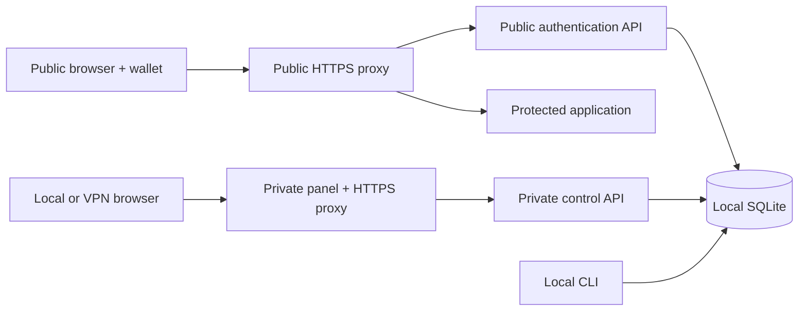

# Alpha architecture

Gozne is a modular monolith. The server and CLI share small storage and policy
modules; splitting them into separately released packages would add work before
there is a second consumer that needs it.

The stack is Node.js 24.20.0, strict TypeScript compiled to ESM, Fastify 5,
`node:sqlite`, and an OCI container. Exact versions are locked in the
repository.

## Components

| Location         | Responsibility                                            |
| ---------------- | --------------------------------------------------------- |
| `src/api`        | Fastify setup, errors, minimal request logging and health |
| `src/auth`       | Login challenges, sessions, CSRF, live authorization      |
| `src/wallets`    | Canonical addresses and exact SIWE/SIWS messages          |
| `src/policy`     | Strict declarative JSON policy validation                 |
| `src/control`    | Invitations, approval proofs and simulated effects        |
| `src/storage`    | Migrations, integrity checks, backup and restore          |
| `cli`            | Local operator commands                                   |
| `examples/login` | Static browser panel and wallet discovery                 |
| `examples/nginx` | Same-origin HTTPS proxy integration                       |

## Persistence and atomicity

SQLite uses WAL, `synchronous=FULL`, a one-second writer timeout and
transactional migrations with checksums. Schema 2 introduced policy, nonces,
sessions and audit. Schema 3 adds invitations, actions, action challenges and
simulated deployments. Existing migration files are immutable.

Login consumes its challenge and creates its session in one transaction. An
approval is revalidated after asynchronous signature verification. Execution
checks both sessions and commits the simulated effect, consumed action and audit
event in one SQLite transaction. A write failure rolls everything back.

This atomicity does not extend to an external API, shell command or deployment
provider. Such adapters need idempotency, an outbox or equivalent delivery
design.

## Policy and access

SQLite is the source of truth. A CLI policy import replaces the entire validated
JSON document atomically; it is not a watched file. An invalid import preserves
the previous policy. An identical import does nothing. An effective change
revokes all sessions and invitations, removes challenges and cancels pending or
approved actions. Executed receipts remain history.

Static policy entries take precedence over invitations. Any wallet present in
the static policy must use that policy, even if disabled or unauthorized for the
application. An invitation cannot bypass it. Dynamic guests receive only
`reader`; the application must require no role other than `reader`.

The panel can also submit application-scoped user edits through JSON. These use
the same validated policy transaction with revision checking and live
administrator authorization. The existing instance-wide invalidation rules
apply. Cross-application wallet changes remain CLI-only.

## Frontend decision

The panel uses local HTML, CSS and JavaScript. The API already owns state,
authentication and validation; these screens do not need server rendering or a
frontend application framework. Tabler was reviewed as a layout reference, but
its code and Bootstrap are not dependencies. Assets are served by Nginx, without
CDNs, inline scripts or unsafe HTML insertion. The interface and public docs are
in English.

## Trust boundaries

- Browser identity headers are untrusted and removed by the proxy.
- Only headers generated after successful authorization reach the protected app.
- The gateway does not trust forwarding headers for rate limits or origins.
- Gateway, database and protected app require a private deployment boundary.
- The CLI is a local administrative interface. Panel administration requires a
  live session with the application's reserved `admin` role; mutations also
  require same-origin checks and CSRF.

The dashboard and control API use private ingress, separate containers and a
separate session audience. The default public API registers no control routes.
Only the backend processes share the local SQLite volume; neither Nginx frontend
can read it. This is a single-host deployment, not a distributed database
design. See [private administration](12-PRIVATE-ADMINISTRATION.md).
