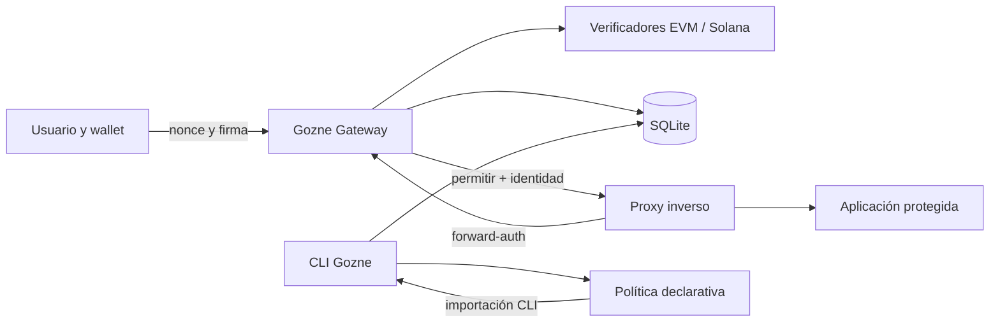

# Arquitectura de la alpha

## Enfoque inicial

Gozne funciona como una sola aplicación modular. Separar prematuramente el
núcleo, el servidor y la CLI en paquetes distintos complicaría releases y
pruebas sin aportar valor a la versión inicial.

Base técnica seleccionada para fase 1:

- Node.js 24 LTS y TypeScript estricto.
- API HTTP con Fastify ejecutada como usuario no privilegiado.
- SQLite con migraciones transaccionales.
- Sesiones opacas de servidor; la cookie solo contiene un identificador
  aleatorio.
- Política declarativa JSON validada mediante esquema.
- Contenedor OCI y Compose como despliegue de referencia.

## Componentes

### Gateway HTTP

- Emite desafíos ligados a origen, dominio, red y tiempo.
- Verifica firmas y consume nonces atómicamente.
- Crea, valida y revoca sesiones.
- Responde a comprobaciones del proxy.
- No sirve la aplicación protegida.

### Verificadores

- **EVM:** SIWE/EIP-4361 mediante `siwe`, para cuentas EOA.
- **Solana:** Sign-In With Solana mediante Wallet Standard y Ed25519 estricto.
  No se admite un flujo alternativo de mensajes libres.
- Los adaptadores producen una identidad normalizada, pero preservan las reglas
  de cada red. Las direcciones Solana son sensibles a mayúsculas.

### Persistencia

SQLite almacena:

- identidades y wallets vinculadas;
- nonces emitidos y consumidos;
- sesiones y revocaciones;
- aplicaciones, roles y políticas efectivas;
- auditoría operativa sin firmas, cookies ni secretos.

Las escrituras críticas deben ser transaccionales. Si no se puede persistir el
consumo del nonce o la sesión, la autenticación falla.

### Política

Ejemplo exclusivamente sintético:

El formato exacto está en [la política de ejemplo](../examples/policy.json). Las
aplicaciones declaran origen HTTPS, cadenas y roles requeridos. Las identidades
vinculan wallets a permisos explícitos por aplicación.

SQLite es la fuente de verdad. La CLI importa el JSON completo de forma atómica;
una importación inválida preserva la política anterior. Un cambio efectivo
revoca todas las sesiones y desafíos, mientras una importación idéntica no hace
nada. El servidor consulta la política efectiva sin reiniciarse.

El código de autenticación y sesiones vive en `src/auth`, la política en
`src/policy` y los verificadores en `src/wallets`. El login de ejemplo está en
`examples/login`, separado del gateway.

## Límites de confianza

- Solo proxies configurados explícitamente pueden aportar cabeceras de cliente.
- Las cabeceras de identidad que llegan desde Internet se eliminan en el borde.
- La aplicación confía en cabeceras generadas por el proxy después de una
  autorización correcta, nunca en cabeceras directas del cliente.
- La CLI opera localmente o mediante un canal administrativo separado.
