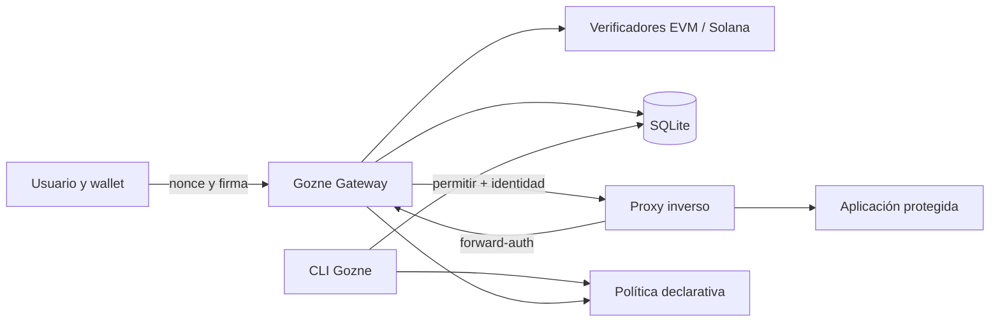

# Arquitectura propuesta

## Enfoque inicial

Gozne comenzará como una sola aplicación modular. Separar prematuramente el
núcleo, el servidor y la CLI en paquetes distintos complicaría releases y
pruebas sin aportar valor a la versión inicial.

Base técnica seleccionada para fase 1:

- Node.js 24 LTS y TypeScript estricto.
- API HTTP con Fastify ejecutada como usuario no privilegiado.
- SQLite con migraciones transaccionales.
- Sesiones opacas de servidor; la cookie solo contiene un identificador
  aleatorio.
- Política declarativa YAML o JSON validada mediante esquema.
- Contenedor OCI y Compose como despliegue de referencia.

## Componentes



### Gateway HTTP

- Emite desafíos ligados a origen, dominio, red y tiempo.
- Verifica firmas y consume nonces atómicamente.
- Crea, valida y revoca sesiones.
- Responde a comprobaciones del proxy.
- No sirve la aplicación protegida.

### Verificadores

- **EVM:** SIWE/EIP-4361 completo mediante una librería mantenida.
- **Solana:** Sign-In With Solana cuando la wallet lo soporte; compatibilidad
  por `signMessage` claramente identificada y ligada al dominio.
- Los adaptadores producen una identidad normalizada, pero preservan las reglas
  de cada red. Las direcciones Solana son sensibles a mayúsculas.

### Persistencia

SQLite almacenará:

- identidades y wallets vinculadas;
- nonces emitidos y consumidos;
- sesiones y revocaciones;
- aplicaciones, roles y políticas efectivas;
- auditoría operativa sin firmas, cookies ni secretos.

Las escrituras críticas deben ser transaccionales. Si no se puede persistir el
consumo del nonce o la sesión, la autenticación falla.

### Política

Ejemplo exclusivamente sintético:

```yaml
applications:
  docs:
    origins:
      - https://docs.example.test
    required_roles:
      - reader

identities:
  example-admin:
    roles: [admin, reader]
    wallets:
      - network: evm
        address: '0x0000000000000000000000000000000000000000'
```

Una recarga inválida se rechaza por completo y conserva la última política
válida.

## Estructura futura del repositorio

```text
GOZNE/
├── src/
│   ├── api/
│   ├── auth/
│   ├── policy/
│   ├── sessions/
│   ├── storage/
│   └── wallets/
├── cli/
├── public/example-login/
├── examples/nginx/
├── examples/compose/
├── migrations/
├── test/
├── docs/
├── openapi.yaml
├── Dockerfile
└── compose.yaml
```

## Límites de confianza

- Solo proxies configurados explícitamente pueden aportar cabeceras de cliente.
- Las cabeceras de identidad que llegan desde Internet se eliminan en el borde.
- La aplicación confía en cabeceras generadas por el proxy después de una
  autorización correcta, nunca en cabeceras directas del cliente.
- La CLI opera localmente o mediante un canal administrativo separado.
