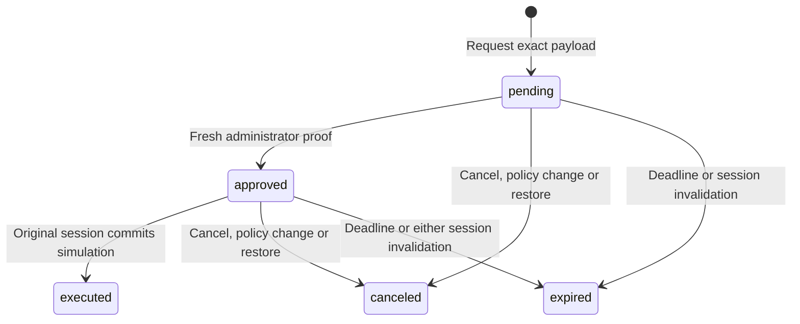

# Control panel, invitations and signed actions

This guide describes the implemented MVP. The panel uses real wallet proofs and
persistent authorization state. Its deployment operation is a **simulation**: it
inserts a receipt in SQLite and does not call a hosting service or execute a
command.

## Start with an administrator

On a new installation, follow the [README](../README.md). The starter
`example-user` identity has `reader` and `admin` for `demo` and no wallets.
Attach your public address with the CLI, then open the HTTPS demo in a browser
with that wallet installed. Select Rabby, MetaMask or another detected EVM
provider explicitly; Phantom handles Solana.

The panel shows `ADMIN` after an administrator signs in. Only administrators can
create or revoke invitations and sign approvals. A valid reader can request an
action and execute an approval bound to their original session. No balance or
NFT ownership grants permissions.

## Upgrading an existing installation

1. With the old image still running, create a fresh backup and copy it outside
   the volume. Record the old image digest. See [recovery](09-RECOVERY.md).
2. Build and start the new image. Migration `003-control-panel.sql` adds control
   tables transactionally. Existing identities and grants are preserved.
3. Export the live policy to `policy.local.json`, as shown in
   [operations](08-OPERATIONS.md#policy-and-cli).
4. For the intended operator only, add `admin` alongside `reader` in the
   application's grant. Preserve all other identities, wallets and grants.
5. Check and apply that reviewed file. A changed policy revokes existing
   sessions and outstanding temporary authority; sign in again.

Example grant fragment, not a complete policy:

```json
{
  "grants": {
    "demo": ["reader", "admin"]
  }
}
```

Do not replace a populated policy with the empty example. The migration never
promotes existing users automatically.

## Walkthrough: owner and collaborator

Use two browser profiles, or separate browsers, so the owner and collaborator
have different session cookies. Each profile needs its own available wallet.

1. **Owner:** sign in with the configured administrator wallet.
2. In **Temporary invitations**, choose the network, enter the collaborator's
   public address and select 30 minutes. Create the invitation.
3. Send the collaborator the normal demo URL. It contains no secret token.
4. **Collaborator:** open that URL in their own profile and sign in using the
   invited wallet. The session receives `reader` and ends no later than the
   invitation deadline.
5. Request a simulated deployment, for example `website`, `v1.2.3`, `staging`.
6. **Owner:** click Refresh, review the request and click **Sign approval**.
   Read the wallet message: project, version, environment, action ID and payload
   hash belong to this request. Approve with the same wallet account as the
   administrator session.
7. **Collaborator:** click Refresh and **Execute simulation once**. A receipt
   appears. A repeated API call is rejected; the UI no longer offers execution.
8. **Owner:** revoke the invitation. The collaborator's existing session loses
   access immediately, including through the protected application's proxy.

For a quick test with one wallet, the administrator can request, approve and
execute their own action. **This MVP does not enforce two-person approval.** A
user signing out cannot transfer an existing request to their next session.

## Invitation semantics

An invitation is a time-limited reader grant for one canonical wallet address
and one application. Its validity begins when created, not when first opened.
The allowed duration is 5–1,440 minutes; the UI offers 30 minutes, one hour,
four hours and one day. `acceptedAt` records its first successful login. The
same wallet may sign in again while the grant remains valid; this is not a
single-use invite link.

The URL is only a route to login. Possessing or forwarding it proves nothing.
The wallet signature supplies the ownership proof. Invitation UUIDs are
metadata, not credentials.

A wallet already present anywhere in the static policy cannot receive a dynamic
invitation. This prevents an invitation from bypassing disabled wallets or
static application restrictions. Invitations only work for applications whose
required roles are empty or contain only `reader`; the creating administrator
must also have `reader`. They never grant administrator access.

Revocation and expiry are checked live. A renewed invitation creates a new guest
identity; it does not revive old sessions. Changes to the static policy revoke
all invitations. Server restarts alone preserve them.

## Action lifecycle



`expired` is a computed API state. The database retains the original pending or
approved record for history, while the API refuses further execution.

The canonical payload is JSON in this exact property order:

```json
{ "project": "website", "version": "v1.2.3", "environment": "staging" }
```

The server computes SHA-256 over its UTF-8 bytes. Project and version are 1–64
ASCII letters, digits, dots, underscores or hyphens, beginning with a letter or
digit. Environment is `preview`, `staging` or `production`; all three are
simulated. There is no payload-edit endpoint. Cancel and create a new request to
change it.

The signed message contains a human-readable deployment statement and resources
`urn:gozne:action:<UUID>` and `urn:gozne:sha256:<hash>`, in addition to the
application resource. SIWE/SIWS also bind wallet, domain, origin URI, chain,
nonce, issue time and expiry. It cannot be replaced with a login signature.

A request lasts at most 30 minutes and never outlives its requesting session. An
approval challenge lasts at most five minutes, capped by both the request and
administrator session. Approval remains valid only until **that same challenge
deadline**; signing near expiry does not grant another five minutes.

Issuing another challenge for the same action and administrator session replaces
the previous one. A matched invalid proof consumes its challenge; a new
challenge can be requested while the action is pending. Both sessions and live
permissions are rechecked at approval/execution. Logout, revocation or expiry
can invalidate a previously approved action.

## API examples

Use the same-origin browser session cookie automatically and the `csrfToken`
returned by `/v1/auth/me` in `X-CSRF-Token` for every POST. Bodies are strict;
unknown fields are rejected. All requests use the session's application.

| Endpoint                                        | Body                                                             | Result                                                           |
| ----------------------------------------------- | ---------------------------------------------------------------- | ---------------------------------------------------------------- |
| `GET /v1/auth/control`                          | None                                                             | Actions, invitation/session metadata for admins, recent receipts |
| `POST /v1/auth/control/invitations`             | `{"network":"evm","address":"YOUR_PUBLIC_ADDRESS","minutes":30}` | Invitation ID, address, expiry, reader role and normal login URL |
| `POST /v1/auth/control/invitations/{id}/revoke` | `{}`                                                             | `{"ok":true}`                                                    |
| `POST /v1/auth/control/actions`                 | Canonical payload fields above                                   | Pending action and payload hash                                  |
| `POST /v1/auth/control/actions/{id}/challenge`  | `{"chainId":"1"}`                                                | Exact message, nonce, expiry; SIWS input for Solana              |
| `POST /v1/auth/control/actions/{id}/approve`    | `{"nonce":"…","message":"…","signature":"…"}`                    | Approved action                                                  |
| `POST /v1/auth/control/actions/{id}/execute`    | `{}`                                                             | Executed action and simulated receipt                            |
| `POST /v1/auth/control/actions/{id}/cancel`     | `{}`                                                             | `{"ok":true}`                                                    |

EVM signatures use `personal_sign` encoding; Solana uses `signIn` and base64
Ed25519 signatures. The full contract is in [OpenAPI](../openapi.yaml).

Administrators see recent actions for their application; readers see only
actions from their current requesting session. All authorized users see recent
simulated deployment receipts for that application. Invitation addresses and
active-session metadata are administrator-only. Raw session hashes are never
returned.

## Execution and integration limits

The simulation inserts one `demo_deployments` row keyed by action ID, changes
the action status and appends an audit event in one transaction. Concurrent
calls produce one effect; a second execution returns `409`. If the audit or
storage write fails, the effect and status change roll back and execution can be
retried.

This guarantees one recorded simulation per action in the current database
history. It does not prevent creating a new action for the same payload, and it
does not provide exactly-once delivery to an external system. Do not execute a
real deployment merely because a browser supplies an approved-looking object. A
future adapter must validate server-side authority and design durable delivery,
idempotency and failure recovery for its actual external effect.

The current audit stream stores event, actor identity, session ID and time;
action/invitation tables provide operation details. Full signatures are not
retained as portable verification receipts. A deployment receipt is operational
evidence in the trusted database, not a standalone cryptographic certificate.

The dashboard supports automatic updates and bounded recent lists. Counters
describe loaded records, not lifetime totals. History has no automatic archival
yet. See [operational limits](08-OPERATIONS.md#current-limits).

Restoration invalidates every invitation and pending approval. See
[recovery](09-RECOVERY.md). Multi-person approval, scoped agent delegation,
passkeys, OIDC and real deployment adapters remain on the
[roadmap](06-ROADMAP.md).

## Active sessions and automatic updates

Administrators can inspect up to 100 active sessions for the current
application, including the identity, network, public address and session
deadlines. **Revoke session** immediately closes that session's authority,
including outstanding approvals signed by it. The current session is labeled
**This session**; use **Sign out** to close it. Revoking a guest session does
not revoke the invitation: that wallet can sign in again until its invitation is
revoked or expires.

`POST /v1/auth/control/sessions/{id}/revoke` accepts `{}` and requires the same
session, Origin and CSRF protections as other mutations. Only administrators can
revoke another session in their application. Missing, expired, already-revoked
or foreign-application sessions return `404`; the caller's own session returns
`409 USE_LOGOUT`. Revocation and the administrator audit event share one commit.

Each overview action includes `permissions.approve`, `permissions.execute` and
`permissions.cancel`. These describe the current session's available controls;
execution authority is never inferred from matching identity names. The server
still revalidates every mutation.

Auto-refresh runs every 30 seconds while signed in, enabled and visible. It
skips wallet interactions and other pending operations. Turn it off with the
checkbox or refresh manually. Failed background requests back off to 60 and then
120 seconds; a successful refresh resets the interval. An invalid session clears
the workspace and stops polling. The panel does not extend a session's lifetime.

## Permanent users, wallets and application roles

**Users & wallets** manages the static policy for the signed-in administrator's
application. Use **Reload users**, choose an existing identity or **Create a new
user**, enter its ID, assign roles and add public EVM/Solana wallet addresses.
Each wallet can be enabled, disabled or removed. Save related edits together.
IDs cannot be renamed. Clearing all roles revokes permanent access to this
application while retaining the identity for later reauthorization; the panel
has no destructive identity-delete operation.

A nonempty grant must include every role required by the application. `admin`
gives administrative privileges for this application; `reader` is ordinary
access in the example. The panel prevents removing the current administrator's
role or disabling/removing the wallet used by that session. The first operator
still needs local CLI bootstrap; public visitors cannot create an administrator.

Wallets belong to global identities in the current policy model. If an identity
has a grant entry for another application, its wallet list is read-only here.
You can change its roles in the current application without changing its other
grants. Use the privileged CLI to manage shared wallets. Identity IDs and wallet
addresses cannot be silently taken over from an existing unrelated identity.

Saving is an atomic, validated policy update with an optimistic revision check.
A stale editor receives `409 POLICY_CONFLICT`; reload and review before
retrying. The operator's live administrator session is checked again inside the
write transaction. Invalid addresses, duplicate wallets and failed audit writes
leave the previous policy and sessions intact. Identical edits are a no-op.

**An effective policy change invalidates all sessions, invitations and pending
approvals across the Gozne instance**, including the administrator's session.
The panel explains this before saving and returns to sign-in afterward. This is
the same conservative behavior as CLI policy imports; it is not limited to the
edited user's sessions. In contrast, the session and invitation revocation
buttons act on their individual targets.

### JSON API

- `GET /v1/auth/control/users`: administrator-only directory containing
  `revision`, `application`, `requiredRoles` and `users`. Each user includes
  `id`, `wallets`, current-application `roles` and `walletsEditable`.
- `POST /v1/auth/control/users`: accepts `revision`, `create`, `id`, a full
  `wallets` array (`network`, `address`, `enabled`) and current-application
  `roles`. Origin, session cookie and CSRF are required. It returns `changed`
  and `reauthenticationRequired`.

The server chooses the application from the session, not from submitted JSON.
The directory is deliberately loaded on sign-in or explicit reload, so
background refresh does not overwrite an unsaved editor. It contains at most the
policy's 1,000 identities, with at most 20 wallets and 20 roles per
identity/application. Full policy export, application definitions and
cross-application changes remain local CLI operations.

### Deployment boundary: current behavior versus next design

The panel talks to the gateway through a same-origin JSON/HTTP API. It is still
served by the demo's existing Nginx and protected by application-role checks.
**This change does not make the administration routes internal-only.**
Publishing that proxy would also publish those authenticated routes.

A separate dashboard container and an internal administration origin/network are
planned for architectural review, not implemented here. A container boundary
alone does not make an API private: ingress rules must also keep administrative
routes off the public authentication listener. A future split must explicitly
handle administrator authentication, host-only cookies, Origin/CSRF checks and
service authorization; it should not share the database directly with a browser
frontend or expose a privileged API token to browser JavaScript.
