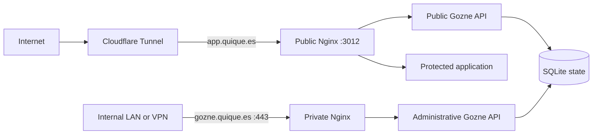

# QUIQUE.ES deployment

The QUIQUE.ES setup gives Gozne two deliberately different doors with one visual
identity.

## The public door 🔑

`https://app.quique.es` is the wallet sign-in application. It is reachable from
the Internet through Cloudflare Tunnel and offers Rabby, MetaMask, other
EIP-6963 wallets and Phantom. Signing proves wallet ownership; it does not send
a transaction, spend gas or expose a private key.

The public proxy serves the sign-in screen and protected application routes. It
does not contain the control panel assets and returns `404` for administrative
API paths.

## The internal door 🛠️

`https://gozne.quique.es` is the operator workspace for applications, permanent
users, wallets, invitations, sessions and signed actions. Gozne terminates its
own TLS connection in the private `admin-panel` Nginx container. The hostname
has no public DNS record and is never added to Cloudflare Tunnel.

On the owner's Mac, the private name resolves through `/etc/hosts`:

```text
172.26.200.110 gozne.quique.es gozne
```

Other trusted devices need the equivalent internal DNS or hosts entry. The
listener accepts the configured LAN and VPN ranges and rejects the Cloudflare
connector before routing a request.



## One visual family 🎨

Both doors use the QUIQUE.ES palette: warm ivory surfaces, near-black type and
amber as the identifying accent. Tight display typography marks the main
actions, while compact labels and quiet borders keep operational data easy to
scan.

The public page stays focused on a single decision: choose a wallet and sign in.
The internal workspace uses the same typography, color and card geometry, but
adds a dark navigation rail, colored status cards and denser controls for
administration. A user can tell that both belong together without mistaking the
public entrance for the private control surface.

The implementation remains local HTML, CSS and JavaScript. It uses no frontend
framework, remote font, analytics script or CDN asset.

The public door, protected workspace and internal panel are available in English
and Spanish. The browser language chooses the initial locale and the header
switcher stores an explicit preference. Human-readable status messages and dates
follow that choice; wallet challenges and signed payloads remain canonical. The
maintenance rules are in the
[internationalization guide](15-INTERNATIONALIZATION.md).

## TLS and renewal 🔒

Cloudflare supplies the public edge certificate for `app.quique.es`. The private
hostname uses the Let's Encrypt lineage issued on `pki01`. A Certbot deploy hook
sends only that lineage to Docker through a dedicated restricted SSH key.

The receiving installer checks the expected hostname, requires more than two
days of validity, verifies that the certificate and private key match, runs
`nginx -t` and reloads only `admin-panel`. If validation fails, it restores the
previous files.

## Production boundaries

| Surface                          | Address               | Exposure                  | TLS endpoint         |
| -------------------------------- | --------------------- | ------------------------- | -------------------- |
| Wallet sign-in and protected app | `app.quique.es`       | Public through Cloudflare | Cloudflare edge      |
| Control panel and management API | `gozne.quique.es`     | Internal LAN/VPN only     | Gozne `admin-panel`  |
| Public origin                    | `172.26.200.110:3012` | Cloudflare connector only | HTTP behind tunnel   |
| Administrative API container     | Docker network only   | No host port              | Behind private Nginx |

The unrelated Nginx host used by `almacen.quique.es` is not part of this path
and requires no Gozne configuration.
